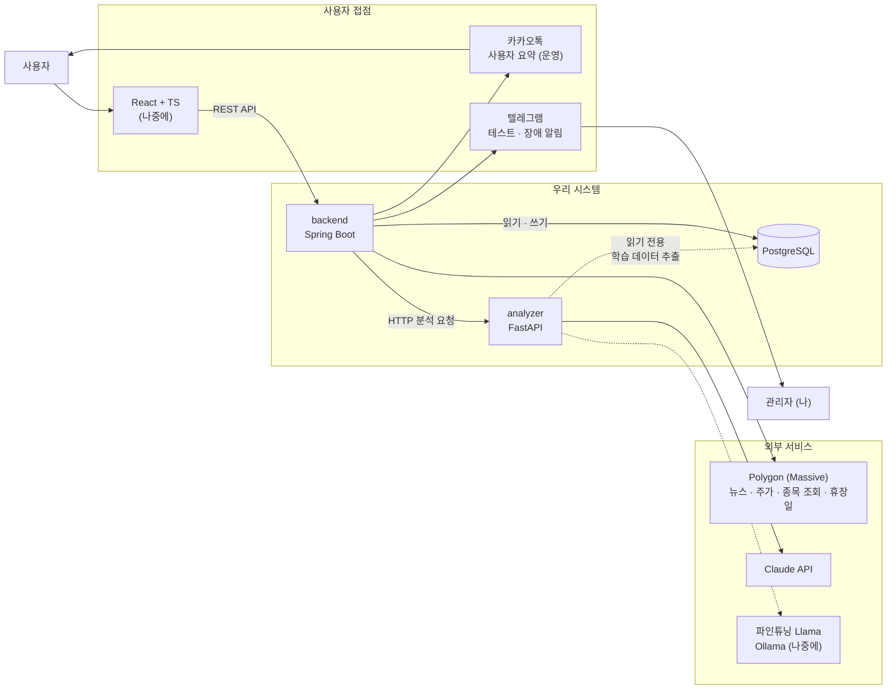
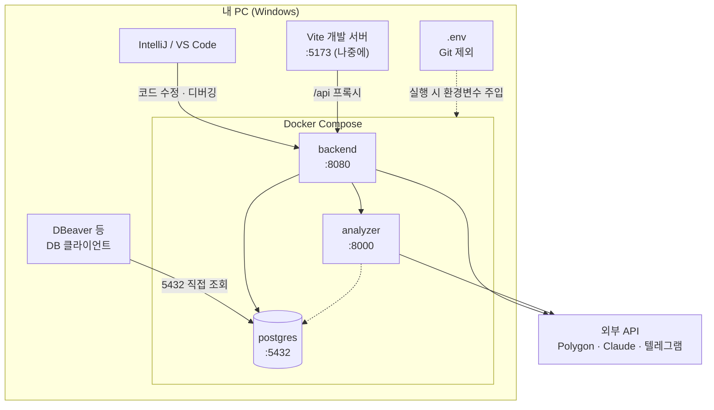
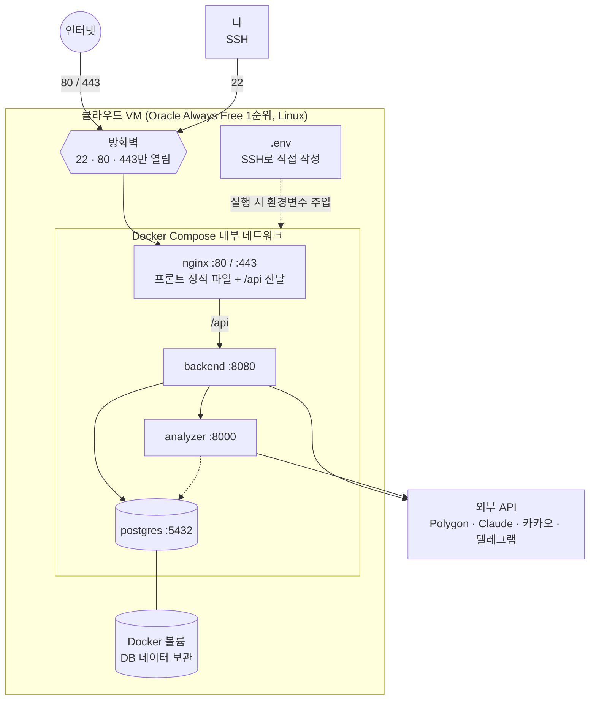
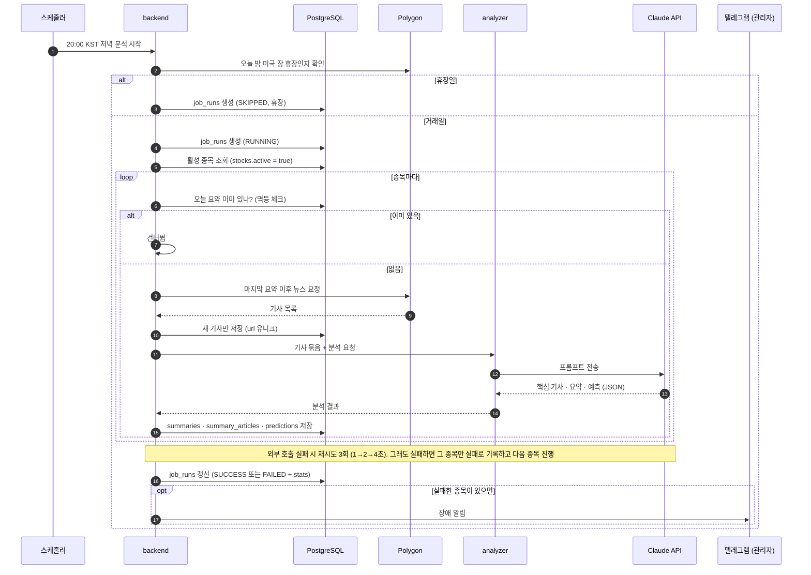
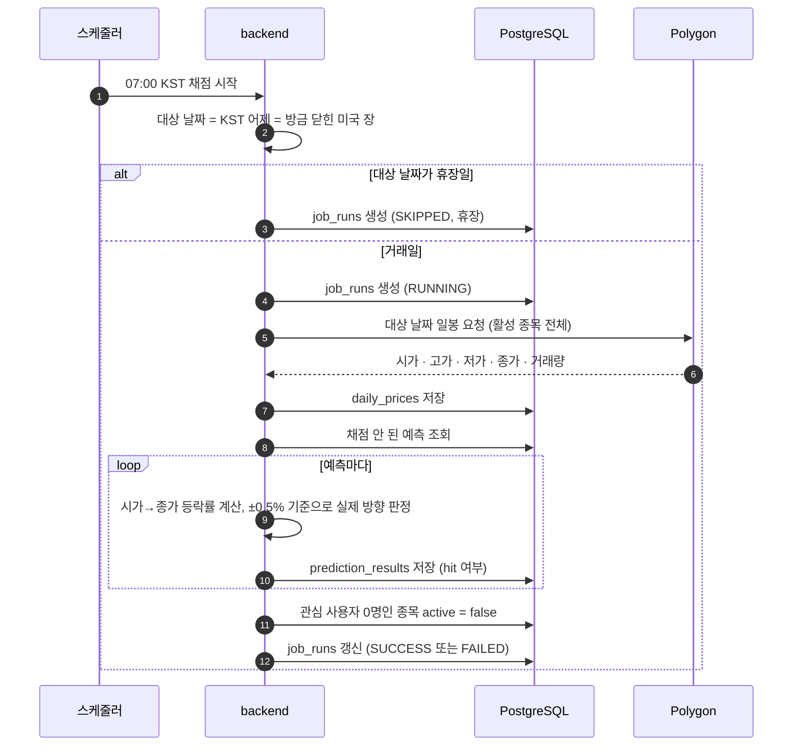
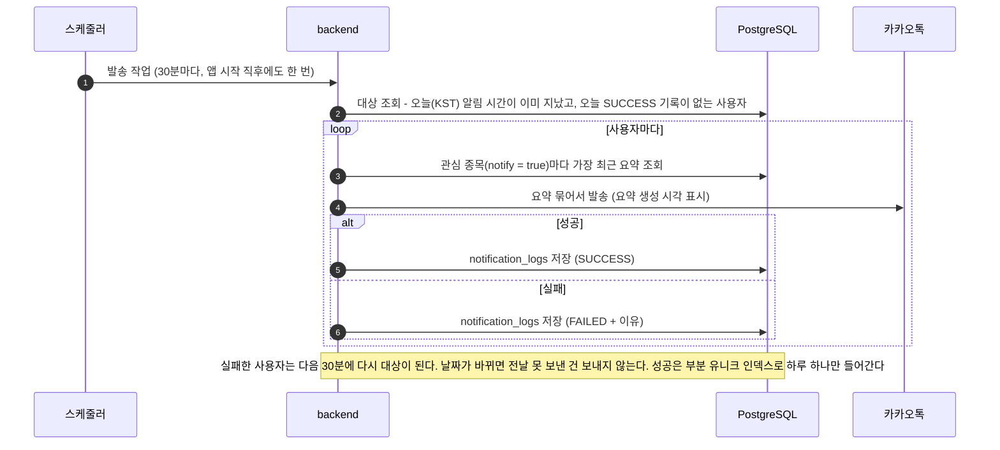
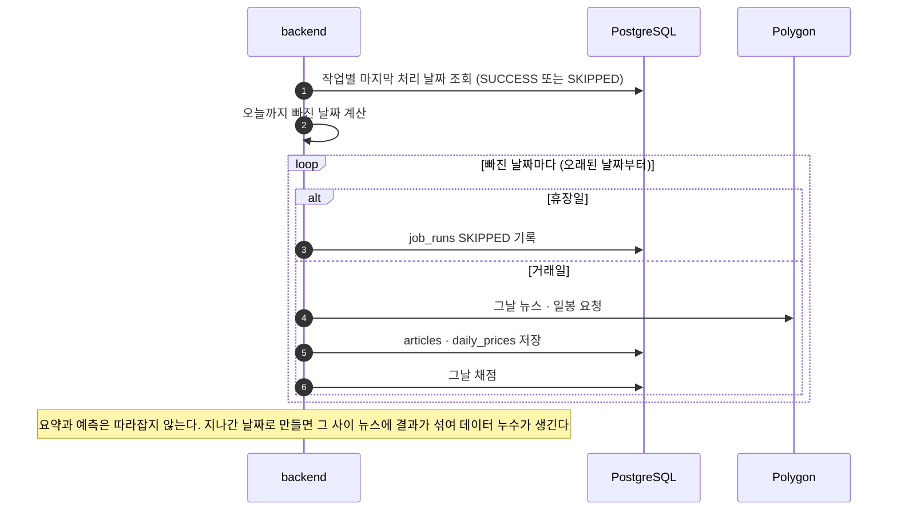
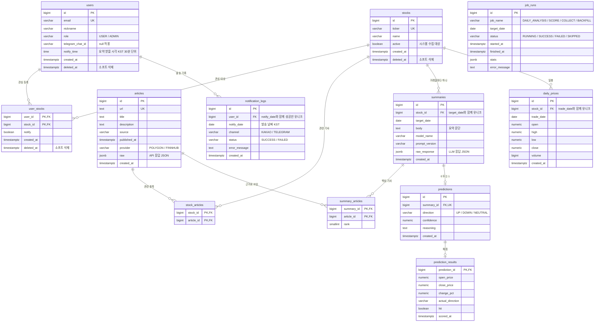

# 구성도

> 설계서(`설계서.md`)의 결정을 그림으로 옮긴 문서. 설계가 바뀌면 이 문서도 함께 고친다.
> 그림은 Mermaid로 작성. GitHub에서는 자동으로 그림이 되고, VS Code는 "Markdown Preview Mermaid Support" 확장, IntelliJ는 마크다운 설정에서 Mermaid를 켜면 보인다.

---

## 1. 아키텍처 구성도

시스템의 부품과 연결. "무엇이 무엇을 부르는가".

읽는 법:
- 실선은 지금 만드는 것, 점선은 나중에 붙이는 것.
- DB 쓰기는 backend만 한다. analyzer는 학습 데이터를 뽑을 때만 읽는다.
- backend에서 외부로 나가는 선(Polygon, analyzer, 카카오, 텔레그램)은 전부 **포트/어댑터**(interface + 구현체)를 거친다. 그래서 Polygon을 Finnhub로, Claude를 Llama로 바꿔도 backend 핵심 로직은 그대로다.
- 사용자 요약과 장애 알림은 통로가 다르다. 카카오 토큰 만료가 장애 원인이면 카카오로는 장애 소식을 못 받기 때문.

---

## 2. 인프라 구성도

부품이 실제로 **어디서** 도는가. local과 prod를 따로 그린다.

### 2-1. local (내 PC)

- 프로파일: `local`. 스케줄은 꺼두고 수동 실행 API로만 돌린다. 알림은 텔레그램.
- postgres 5432를 PC에 열어 DB 클라이언트로 직접 본다. 내 PC는 공유기 뒤라 인터넷에서 직접 못 들어와서 안전하다.

### 2-2. prod (클라우드 VM)

- 프로파일: `prod`. 스케줄 켜짐. 사용자 요약은 카카오톡, 장애 알림은 텔레그램.
- **밖에서 들어올 수 있는 건 nginx뿐.** backend, analyzer, postgres 포트는 VM 밖으로 안 연다. 아파트로 치면 nginx가 정문 경비실이고, 나머지는 단지 안 통로로만 연결된다.
- **DB 데이터는 Docker 볼륨에.** 컨테이너는 배포 때마다 버리고 새로 만드는 일회용이라, 볼륨 없이 두면 데이터도 같이 사라진다.
- `.env`는 이미지 안에 들어가지 않는다. VM 바닥에 있고 Compose가 컨테이너를 띄울 때 읽어서 주입한다.

---

## 3. 데이터 흐름도

하루 동안 무슨 일이 어떤 순서로 일어나는가.

### 3-1. 저녁 분석 작업 `DAILY_ANALYSIS` (KST 20:00, 미국 장 열리기 전)

뉴스를 모아 요약과 예측을 만든다. 사용자에게 보내는 건 3-3 발송 작업이 따로 한다.

### 3-2. 아침 채점 작업 `SCORE` (KST 07:00, 미국 장 닫힌 뒤)

### 3-3. 사용자별 발송 작업

저녁 분석이 만든 요약을 사용자마다 정한 시간에 보낸다. 요약은 종목당 한 번만 만들고 발송만 나눠 한다. 이 작업은 `job_runs`에 기록하지 않고, 이력은 `notification_logs`에 남는다.

### 3-4. 앱 시작 시 따라잡기

### 3-5. 백필 `BACKFILL` (최초 1회, 수동)

과거 2년치 뉴스와 일봉을 한꺼번에 저장한다. Claude를 거치지 않는다. 수동 실행 API로 시작하고 `job_runs`에 `BACKFILL`로 기록한다. Polygon 무료 티어(분당 5회)에 맞춰 요청 사이에 간격을 둔다.

---

## 4. ERD

`job_runs`는 다른 테이블과 연결이 없는 독립 테이블이다. 인덱스 목록은 설계서 4-11 참고.
